# 东南大学讲座预约助手（SEU Lecture Reserve Assistant）

当前版本：`0.2.0`

面向东南大学讲座预约页面的 浏览器(Edge、Chrome) 扩展，用来减少手动盯页面和重复点击。现在的交互更直接：

- 在讲座卡片旁直接点击 `提前预约`
- 侧边栏只显示计划任务
- 任务会在预约日的次日自动清理

当前仅支持页面！！！：

- `https://ehall.seu.edu.cn/gsapp/sys/yddjzxxtjappseu/*default/index.do#/hdyy`

## 核心功能

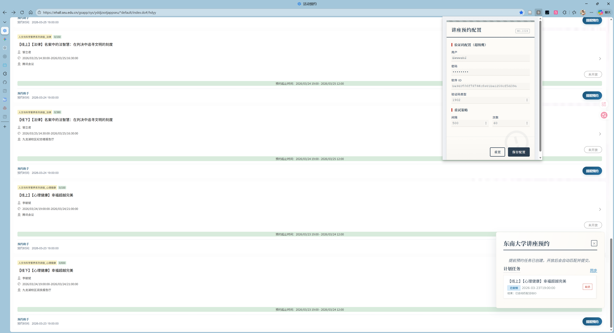

- 页面内自动识别讲座，并在对应讲座卡片旁显示 `提前预约` 按钮
- 支持提前创建预约任务，到点后自动提交
- 后台自动重试预约请求
- 接入超级鹰验证码识别
- 侧边栏集中查看任务状态、结果和取消入口
- 任务会在次日自动清理，不会长期堆积

## 安装

1. 下载并解压项目代码。
2. 打开浏览器，进入 `管理拓展`。

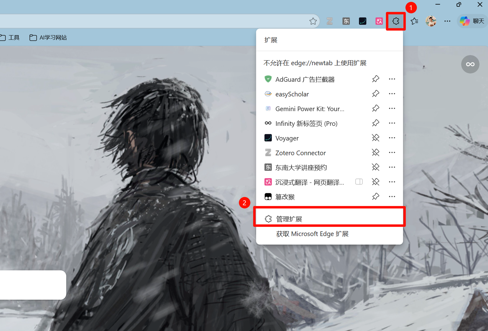
3. 开启“开发人员模式”。
4. 点击“加载解压缩的扩展”，选择本项目的 `Assistant` 目录。

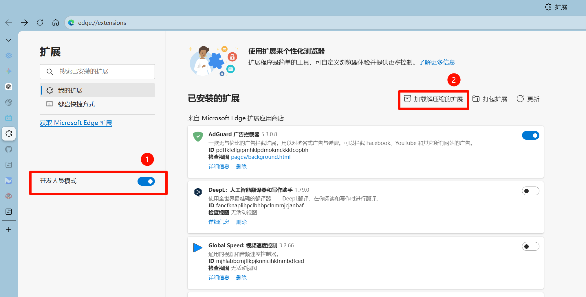

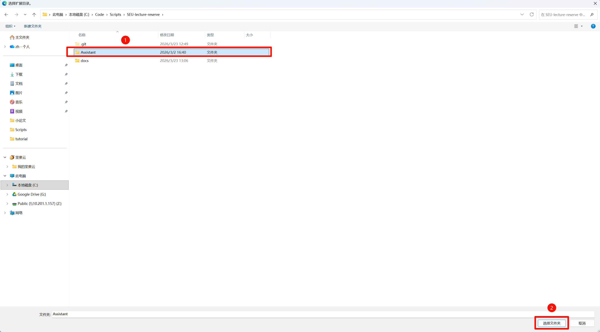

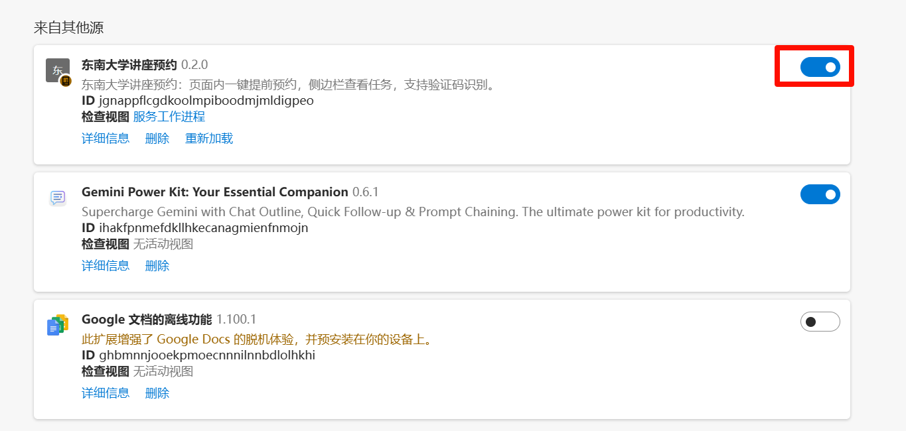

## 超级鹰注册

扩展默认使用超级鹰识别验证码。

1. 访问 `http://www.chaojiying.com/` 注册账号（会通过邮箱的方式发送密码）。

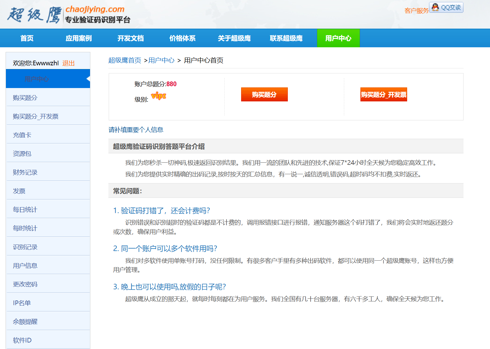
2. 给账号充值1元保证账号正常（1元即可）。

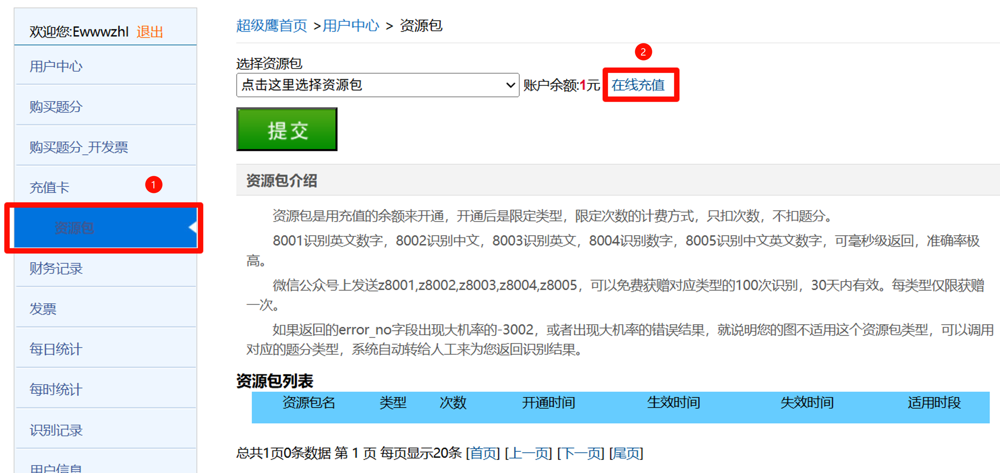
3. 微信关注公众号获取1000题分。
 

4. 在个人中心申请 `软件 ID（softid）`。

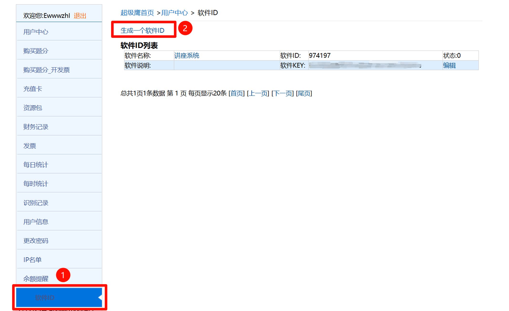

## 使用方法

1. 点击扩展图标，打开配置页。
2. 填写超级鹰账号、密码和软件 ID。
3. 保持默认重试参数，点击 `保存配置`。
4. 打开讲座预约页面 `#/hdyy`。
5. 在目标讲座卡片旁点击 `提前预约`。
6. 需要时打开右侧侧边栏，查看任务状态或取消任务。

## 图文教程

### 1. 打开扩展配置页

点击浏览器工具栏中的扩展图标，打开插件配置页。

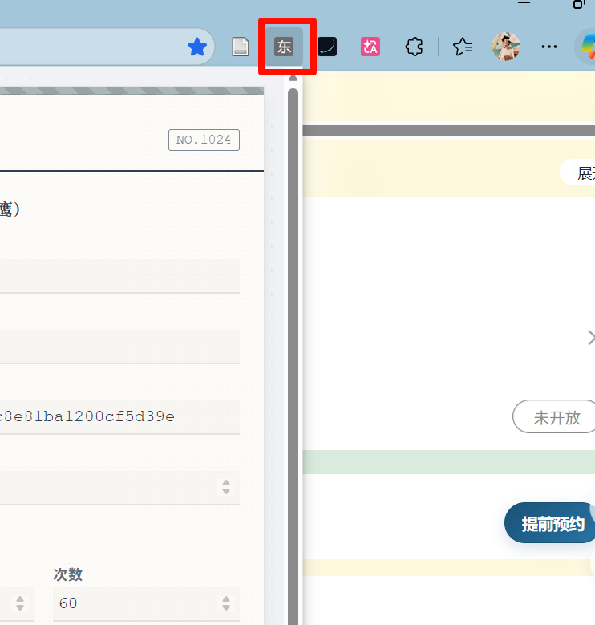

### 2. 填写并保存验证码配置

填写超级鹰账号、密码和软件 ID，保持推荐重试参数后点击 `保存配置`(软件 ID实际上是指key)。

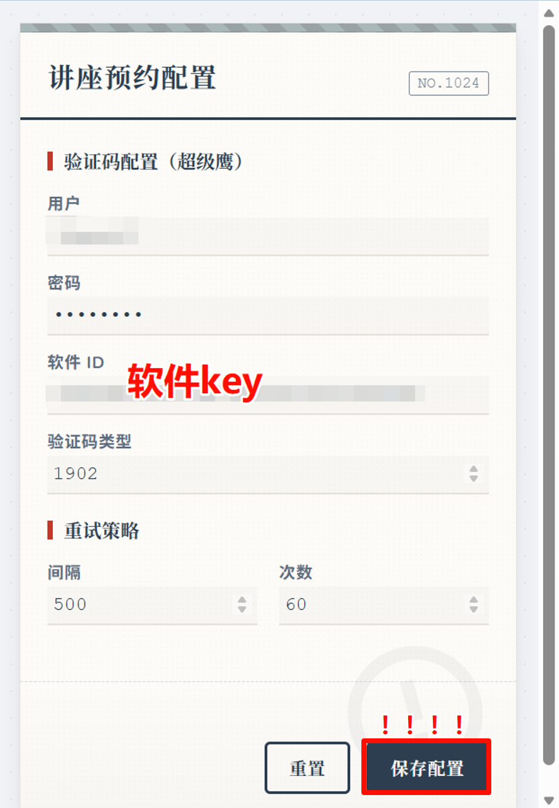

### 3. 打开讲座预约页面

进入东南大学讲座预约页面 `#/hdyy`，等待页面中的讲座卡片加载完成。

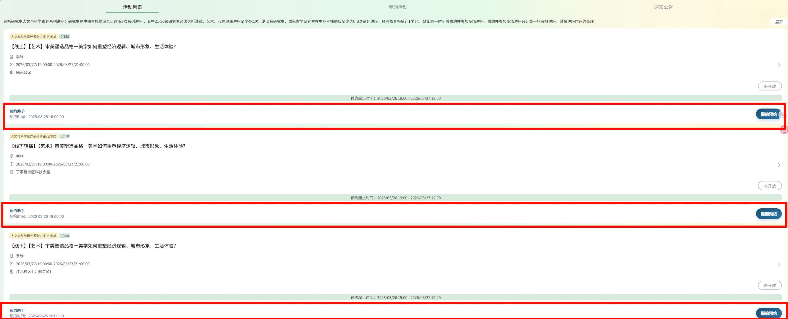

### 4. 在讲座卡片旁点击提前预约

在目标讲座卡片旁找到 `提前预约` 按钮，直接点击创建任务。

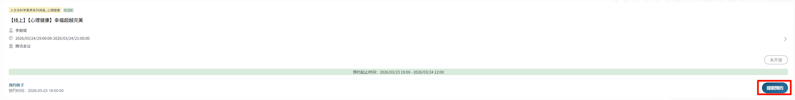

### 5. 打开侧边栏查看计划任务

点击右侧侧边标签，展开任务面板，确认任务已经加入计划列表。

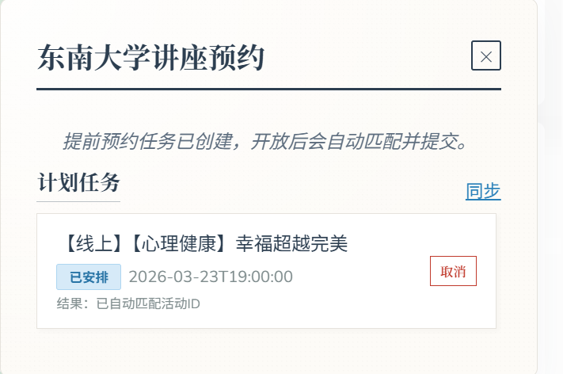

### 6. 查看任务状态变化

在侧边栏里查看任务状态、预约结果和自动重试情况。

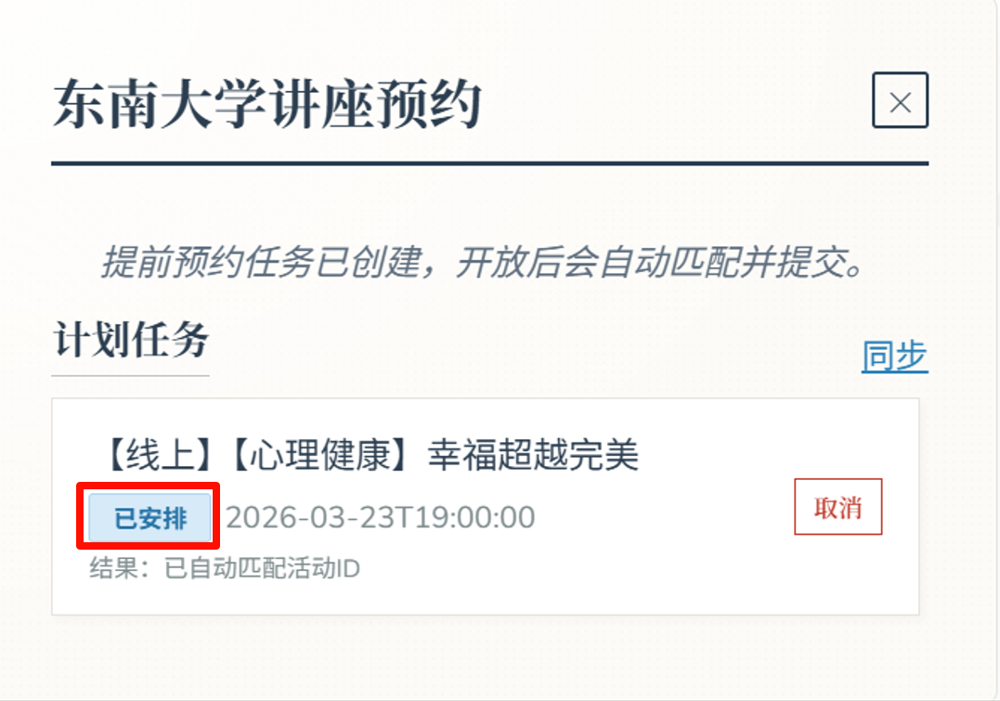

### 7. 取消不需要的任务

如果不再需要某个预约任务，可以在侧边栏中点击 `取消`。

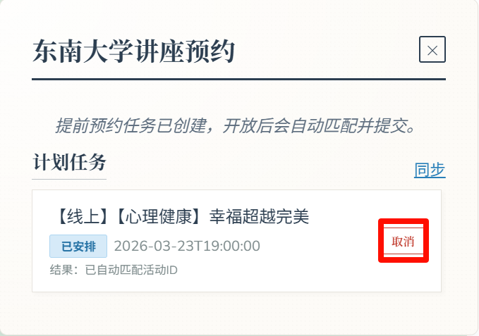

## 常见问题

### 看不到 `提前预约` 按钮

- 确认当前页面是 `#/hdyy`
- 刷新页面后重试
- 重新加载扩展，确保代码为最新版本

### 点击按钮后没有成功预约

- 确认 ehall 账号仍处于登录状态
- 检查超级鹰余额、账号和 `softid` 是否正确
- 适当提高 `retryMaxAttempts` 或降低 `retryIntervalMs`

### 任务列表没有清空

- 当前版本会在预约日的次日自动清理
- 如果扩展刚更新，刷新页面或重载扩展后会重新同步

### 提示扩展上下文失效

- 这是扩展热更新后的常见现象
- 刷新页面并重新打开扩展即可

## 注意事项

- 本工具仅辅助提交，不保证 100% 成功。
- 预约结果受平台开放时间、名额、网络和账号状态影响。
- 请遵守学校平台使用规范，合理使用自动化功能。
